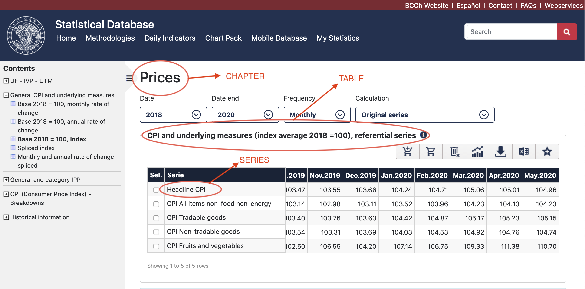
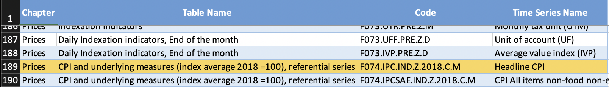

#  A quick way to download data using the Central Bank of Chile's API

The Central Bank of Chile (CBCh) provides and maintain a [public database](https://si3.bcentral.cl/siete/EN). In order to access the data, users have to perform several steps/mouse-clicks to get the data in their computer. The only format in which the data can be downloaded directly from the database is `*.xls`. 

 To speed up the process and get comma separated values (`*.csv`) files, I provide a couple of `Python` routhines to speed up the process.  One of the major gains of this workflow is to avoid clicking and get version control systems to work with data-base changes (`csv` files differences can be tracked by Git, for example)

## What do you need to make it work

1. Get the API username and password
2. Python 3 installed and running
3. Select the series you want to download

## Get the API username and password
Follow the instructions [here](https://si3.bcentral.cl/estadisticas/Principal1/web_services/index_EN.htm) 

Get better acquainted with the database [here](https://lmgtfy.com/?q=central+bank+of+chile+API) (haha)

Once you have tour username and password, copy them into the credentials in `getData.py`

## Python

[Let Me Google That For You](https://lmgtfy.com/?q=how+to+install+python+3), again.

## How to identify the series you want to download

 The most up-to-date data catalog with the `Code` to get access trough the API can be found [here](https://si3.bcentral.cl/estadisticas/Principal1/Web_Services/Webservices/series_en.xls).  In this repo you can find a copy of it plus a couple of extra pages inside.  If you know what series you want to use just add a `1` in the column `use` (which I created), save the document and you're all good to go. In the third sheet, first cell, you will find the comma separated series you selected. This cell wil be read by the `Python` script to get the desired data.
 
 If you don't know what series you want and you want to see them first, the only way to match the online series to the ones in the Excel catalog is by copying the name of the Chapter, Table and Series.  

 
Example

In the first image you can see where to find the chapter, table and series names to find the `Code` in the catalog (second image)

 

<figcaption>Fig.1 - Online Database</figcaption>

<figcaption>Fig.2 - Data Catalog (selected section)</figcaption>
 

 

Once you have a selection of the series inside the spreadsheet, you can run the `getData.py`, and, voila, you'll get the `csv` files for the diferent frequencies (i.e. `DAILY.csv`, `MONTHLY.csv`, `QUARTERLY.csv`, and `ANNUAL.csv`)
